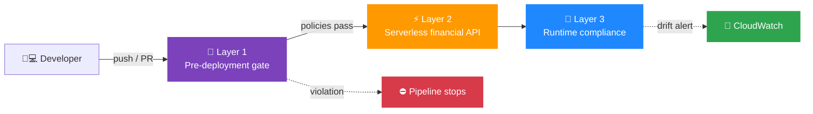
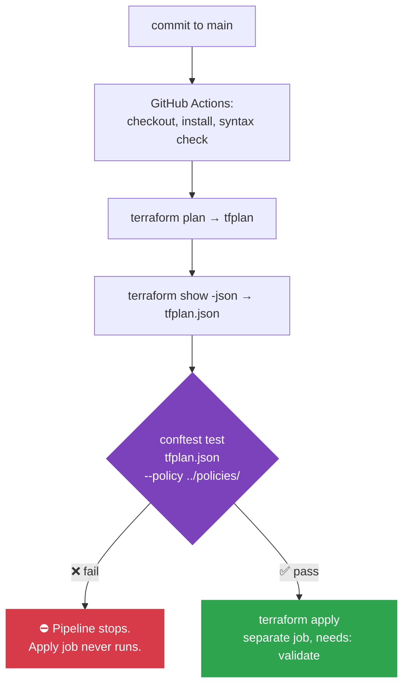

<h1 align="center">🛡️ AWS Serverless Zero Trust Governance</h1>

<p align="center">
  <b>Block misconfigured infrastructure at the pull request. Catch drift after deployment.</b><br/>
  A Policy-as-Code governance framework for AWS serverless financial applications.
</p>

<p align="center">
  
  
  
  
</p>

<p align="center">
  
  
  
  
  
</p>

<p align="center">
  <a href="#problem">Problem</a> •
  <a href="#architecture">Architecture</a> •
  <a href="#flow">Flow</a> •
  <a href="#scenarios">Scenarios</a> •
  <a href="#results">Results</a> •
  <a href="#limitations">Limitations</a> •
  <a href="#run-it">Run It</a>
</p>

> 🎓 Built as an undergraduate project at the **Federal University of Technology, Minna**. The framework was designed, implemented, and tested against four misconfiguration scenarios. Results and limitations are documented honestly below.

---

<a id="problem"></a>

## 🔥 The Problem

Serverless shifts infrastructure configuration onto developers. Every Lambda needs an IAM execution role, every API endpoint needs an authorizer, and every S3 bucket needs a public access block. Get one wrong and **the deployment still succeeds**. Nothing fails. The misconfiguration just sits there until someone finds it.

Most tooling is reactive:

| Approach | The gap |
| :--- | :--- |
| 🔍 **Scanners** | Identify problems *after* deployment |
| ⏱️ **Runtime monitors** | Flag drift *on a schedule* |

Both leave a window between the misconfiguration existing and anyone knowing about it.

> ✅ **This framework closes that window at the earliest point it can: the pull request.**

---

<a id="architecture"></a>

## 🧱 Architecture

Three distinct layers, each covering a different moment in the lifecycle.

| Layer | What it does | Tools |
| :---: | :--- | :--- |
| 🚧 **1. Pre-deployment governance** | Terraform defines the infrastructure. On every push, GitHub Actions runs `terraform plan`, converts it to JSON, and evaluates it against Rego policies. A violation exits non-zero, the step fails, and the apply job never runs. Terraform never reaches the AWS API. | `Terraform` `OPA` `Conftest` `GitHub Actions` |
| ⚡ **2. Application** | The serverless financial API itself: Lambda for transaction logic, API Gateway for routing and JWT validation, DynamoDB for state, Cognito for identity. | `Lambda` `API Gateway` `DynamoDB` `Cognito` |
| 📡 **3. Runtime compliance** | AWS Config managed rules evaluate deployed resources against a baseline. A manual change made outside the pipeline is detected and flagged through CloudWatch alerts. | `AWS Config` `CloudWatch` |



---

<a id="flow"></a>

## 🚀 How a Deployment Flows



> ⏱️ The gate adds about **7.3 seconds** to a pipeline run.

---

<a id="scenarios"></a>

## 🎯 Misconfiguration Scenarios

The policy library covers four specific scenarios. Each has a rule at the pre-deployment layer and, where applicable, at the runtime layer.

| | Scenario | What it catches | Rule type |
| :---: | :--- | :--- | :--- |
| 🔑 | **Over-privileged IAM roles** | `"Action": "*"` or `"Resource": "*"` in a policy document | `Rego` |
| 🪣 | **Publicly exposed S3 buckets** | Public access block disabled | `Rego` + `AWS Config` |
| 🚪 | **Unauthenticated API endpoints** | API Gateway method with no authorizer | `Rego` + `Custom Config rule` |
| 📝 | **Disabled execution logging** | API Gateway stage with no logging | `Rego` + `AWS Config` |

---

<a id="results"></a>

## 📊 Results

Tested against the four scenarios above.

| Metric | Result |
| :--- | :---: |
| ✅ **Enforcement success rate** | **100%** |
| 🎯 **Detection accuracy** | **100%** |
| 🚫 **False positive rate** | **0%** |
| ⚡ **Enforcement latency** | **7.3 s** |
| 📡 **Runtime detection latency** | **3 min 30 s** |
| 🌐 **API latency overhead** | **~46 ms** |

> [!NOTE]
> Four scenarios is a small sample. Read this as evidence the approach works, not as a definitive total detection rate.

---

<a id="limitations"></a>

## ⚠️ Limitations

Being upfront about what this doesn't catch.

<details>
<summary><b>🔤 Service-level wildcards</b></summary>
<br/>

The rule matches a bare `"*"`. A permission like `"s3:*"` is not caught and would need regex or pattern matching rather than an exact string comparison.
</details>

<details>
<summary><b>🖱️ Changes made outside the pipeline</b></summary>
<br/>

A resource created or modified directly in the AWS Console bypasses the pre-deployment gate. The runtime layer catches these, but only after the fact, and AWS Config evaluates on a schedule rather than immediately.
</details>

<details>
<summary><b>📋 Platform policies that require a wildcard</b></summary>
<br/>

AWS requires a wildcard resource for a small number of platform-level policies. The repository excludes those by name. Any real deployment will need a similar exception list.
</details>

<details>
<summary><b>🤫 Silent policy failures</b></summary>
<br/>

There is a failure mode where the check passes because it cannot read the policy at all. This requires separate validation to ensure policies are loaded correctly.
</details>

---

## 📁 Repository Structure

```text
├── 🏗️  terraform/                # Infrastructure definitions
├── 📜  policies/                 # Rego policies evaluated by Conftest
├── ⚡  lambda/transaction_api/   # Application code
├── 🤖  .github/workflows/        # CI/CD pipeline
└── 🗒️  scratch/                  # Notes and working files
```

---

<a id="run-it"></a>

## 🧪 Running It

### Prerequisites

- 
- 
- 

### Local evaluation

```bash
cd terraform
terraform init
terraform plan -out=tfplan
terraform show -json tfplan > tfplan.json
conftest test tfplan.json --policy ../policies/ --all-namespaces
```

> 💡 **See the gate work:** break something in `terraform/` that one of the policies covers (for example, set an IAM `"Action": "*"`) and run the plan and test steps again. Conftest exits non-zero and prints the exact policy violation.

---

## 🧰 Tech Stack

<p>
  
  
  
  
</p>
<p>
  
  
  
  
</p>
<p>
  
  
</p>

---

## 👤 Author

<table>
  <tr>
    <td>
      <b>Victor Okoroafor</b><br/>
      AWS Certified Cloud Engineer | DevSecOps &amp; Cloud Security<br/><br/>
      <a href="https://linkedin.com/in/victor-okoroafor-cloud"></a>
      <a href="mailto:victor.okoroafor.cloud@gmail.com"></a>
      <a href="https://github.com/vicGrey"></a>
    </td>
  </tr>
</table>

<p align="center">
  <sub>⭐ If this helped you think about shifting cloud security left, consider starring the repo.</sub>
</p>
